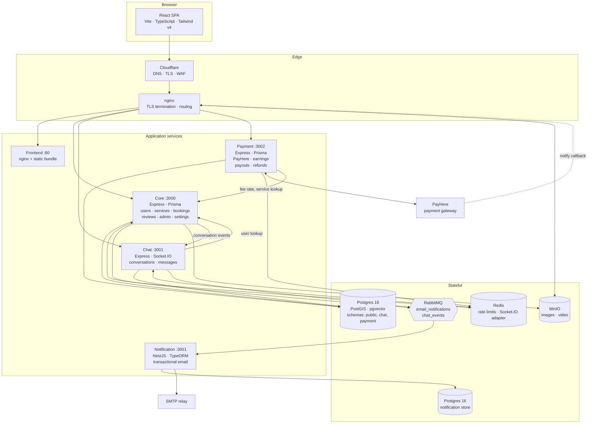
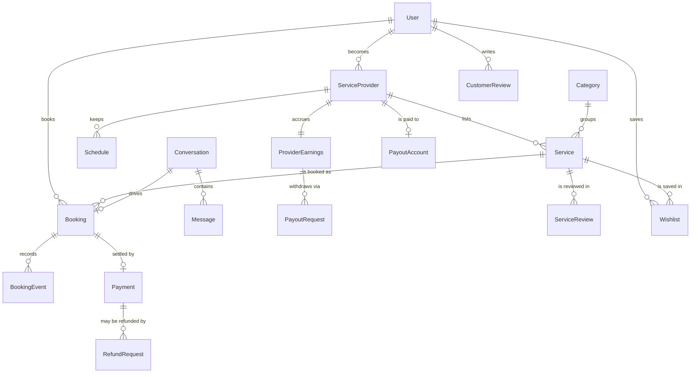
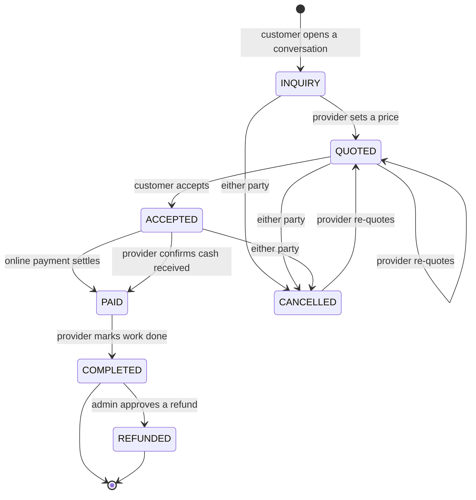
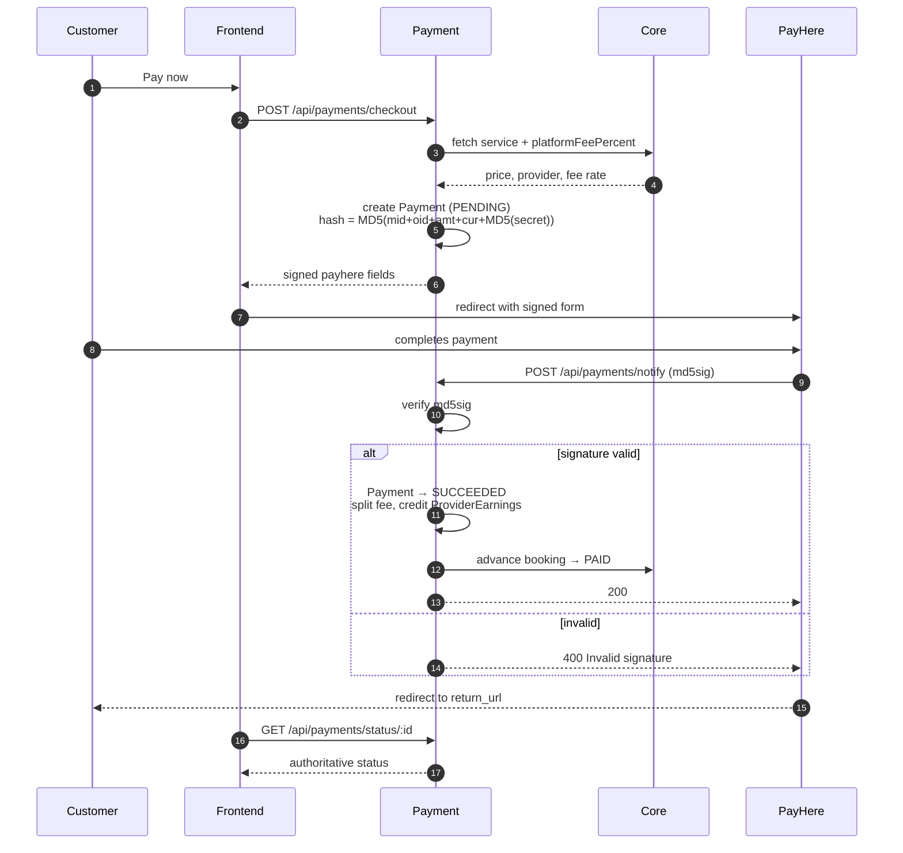
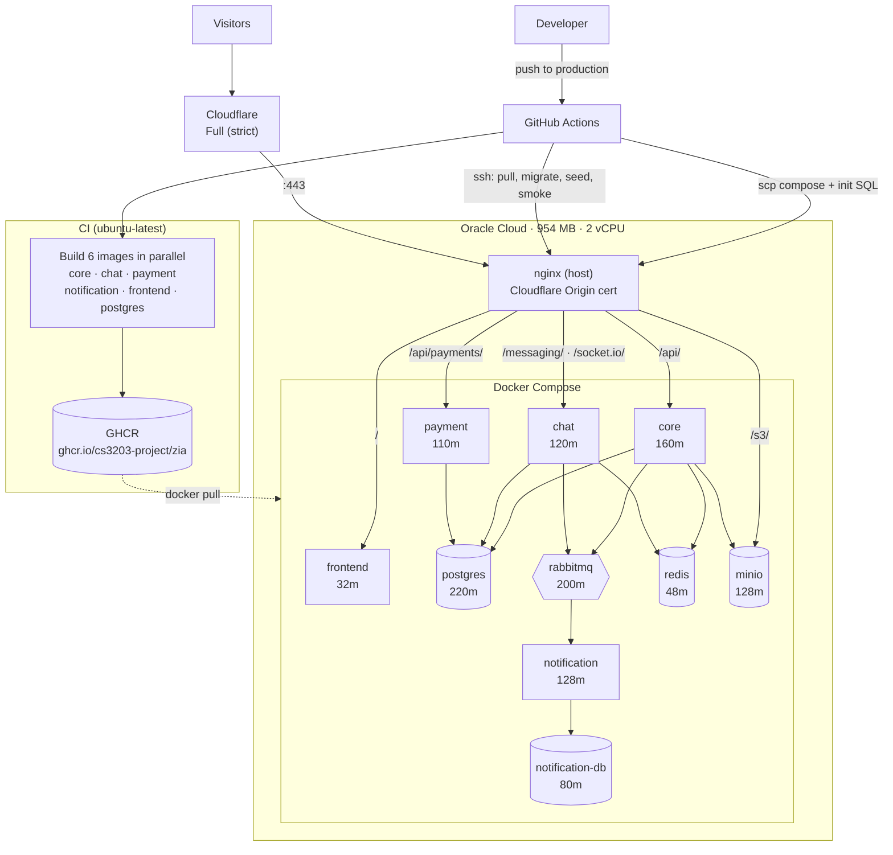

# Zia

A local services marketplace. Customers find providers, negotiate in chat, book a
time slot, pay online or in cash, and review afterwards. Providers list services,
quote prices, manage a schedule, and withdraw earnings. Admins configure platform
rules, verify providers, review listings, and settle payouts and refunds.

Built as five deployable units — four backend services and a single-page frontend —
sharing one Postgres instance (separate schemas), a RabbitMQ bus, Redis, and MinIO.

- **Live:** https://zia.motionstack.org
- **Currency:** LKR · **Gateway:** PayHere (sandbox)

---

## Contents

- [Architecture](#architecture)
- [Services](#services)
- [Data model](#data-model)
- [Booking lifecycle](#booking-lifecycle)
- [Payment flow](#payment-flow)
- [Deployment](#deployment)
- [CI/CD](#cicd)
- [Local development](#local-development)
- [Configuration](#configuration)
- [Operational notes](#operational-notes)

---

## Architecture

Each backend service owns its own Prisma schema and talks to the others over HTTP
(synchronously, with an internal API key) or RabbitMQ (asynchronously, for events
that must not block a request). The frontend is a static bundle served by nginx;
it never talks to a database directly.



**Why the split.** Chat holds a websocket connection per active user and would
otherwise make Core's memory profile unpredictable. Payment isolates gateway
credentials and money movement. Notification is the only component allowed to
send email, so a mail outage degrades one queue consumer instead of blocking
signups and bookings.

**Redis** does double duty: a shared rate-limit store so limits hold across
replicas, and the Socket.IO adapter so chat can scale horizontally.

---

## Services

| Service | Stack | Port | Owns |
|---|---|---|---|
| **Core** | Express · TypeScript · Prisma | 3000 | Users, providers, companies, categories, services, schedules, bookings, reviews, wishlists, notifications, admin, platform settings |
| **Chat** | Express · Socket.IO · Prisma | 3001 | Conversations and messages (`chat` schema) |
| **Payment** | Express · Prisma | 3002 | Payments, provider earnings, payout requests and destinations, refund requests (`payment` schema) |
| **Notification** | NestJS · TypeORM | 3001 (3003 host) | Consumes RabbitMQ, renders and sends email |
| **Frontend** | React · Vite · Tailwind v4 | 80 (8080 host) | SPA, served as static files by nginx |

### Notable Core capabilities

- **Geospatial search** — PostGIS; services carry a location and are searchable by radius.
- **Semantic search** — pgvector embeddings generated via Gemini, exposed as `/api/services/search/hybrid`, blending keyword and vector similarity.
- **Platform settings** — admin-editable values (`platformFeePercent`, `allowCashPayments`, `minPayoutAmount`, `maxUploadSizeMb`, `maxServiceImages`, `requireServiceApproval`, `requireProviderVerification`) read at request time rather than baked into code. `requireProviderVerification` defaults **on**, so a provider cannot publish a listing until an admin approves them.
- **Account lifecycle** — email verification and password reset using SHA-256 hashed, single-use, expiring tokens. Password reset always reports success so the endpoint can't be used to enumerate accounts.
- **Save for later** — a private per-customer wishlist keyed unique on `(userId, serviceId)`. Every route takes the user from the token; nothing accepts a `userId` from the client. Delisted services stay in the table but are filtered from the list, so a service returns if its provider relists it.
- **Formatted descriptions** — listings accept a small Markdown subset (bold, italics, bullets, numbered steps). Stored as Markdown and rendered to React nodes, never through `dangerouslySetInnerHTML`: React escapes every text node and only the renderer's own tags are constructed, so there is no sanitiser to get wrong.

---

## Data model



A **`Booking` is keyed one-to-one on `conversationId`**. This matters: an earlier
design keyed scheduling on `(userId, providerId)`, which meant a customer who
hired the same provider twice had both jobs collapse into one record, and the
second booking could attach itself to the wrong conversation. Tying the booking
to the conversation makes repeat business work correctly.

---

## Booking lifecycle

Six states with per-transition actor guards — a transition is rejected unless the
caller is the right party in the right state.



Rules worth knowing:

- **Only one action is offered per party per state**, so neither side has to guess whose turn it is.
- **Cancelling is not a dead end.** A cancelled booking can be re-quoted, which is what happens when a customer comes back later.
- **Reviews unlock at `COMPLETED`.** Posting a review requires a completed booking; the reviewer is taken from the auth token, never from the request body.
- **Double-booking is prevented.** Before committing, the system looks for an overlapping `ACCEPTED`/`PAID` booking for the same provider (`scheduledStart < newEnd AND scheduledEnd > newStart`).
- **Every transition writes a `BookingEvent`**, which is what drives the timeline view and the unread-notification badge (`readAt` distinguishes *new activity* from *current state*).

---

## Payment flow

PayHere is a redirect gateway: the browser posts a signed form to PayHere, and
PayHere confirms the result server-to-server. The callback is authoritative — the
browser returning to the success page is **not** treated as proof of payment.



**Money split.** On settlement the payment is divided by `platformFeePercent`
(admin-configurable, default 5%). On LKR 1500 that is LKR 75 to the platform and
LKR 1425 credited to the provider's `availableBalance`.

**Payouts** move value across three buckets in a single transaction — request
(`available → pending`), approve (`pending → withdrawn`), reject (`pending →
available`) — so a failed step can never strand funds in between.

**Payout destinations are bank accounts, not cards.** A card is the instrument
for taking money, not sending it, and storing a card number would put the
platform in PCI-DSS scope for no benefit. `PayoutAccount` holds the provider's
bank details; the number is returned masked to the last four everywhere except
the transfer path, which is a separate function so revealing it in full is always
a deliberate call. The admin payout list carries the destination, because
approving a transfer without it is a decision made without the one detail it
depends on.

**Cash** is an alternative path: when `allowCashPayments` is on, the provider
marks the booking cash-paid, which moves `ACCEPTED → PAID` without touching the
gateway.

**The notify URL must be publicly reachable, unauthenticated, and must not
redirect.** nginx routes `/api/payments/notify` straight to the Payment service
ahead of the general `/api/` rule for exactly this reason.

### Testing in sandbox

With `PAYHERE_MODE=sandbox` no real money moves, and the gateway accepts **only**
its own test cards — any other number is refused with *"Unknown card"*, which is
the usual reason a sandbox payment appears to fail for no reason.

**Successful payment**

| Card | Number |
|---|---|
| Visa | `4916217501611292` |
| MasterCard | `5307732125531191` |
| AMEX | `346781005510225` |

**Decline scenarios** — worth exercising, because the failure path is the one that
tends to go untested. A declined payment must leave the booking in `ACCEPTED`, not
silently advance it.

| Scenario | Visa | MasterCard | AMEX |
|---|---|---|---|
| Insufficient funds | `4024007194349121` | `5459051433777487` | `370787711978928` |
| Limit exceeded | `4929119799365646` | `5491182243178283` | `340701811823469` |
| Do not honor | `4929768900837248` | `5388172137367973` | `374664175202812` |
| Network error | `4024007120869333` | `5237980565185003` | `373433500205887` |

Name on card, CVV and expiry accept any valid data — use a future expiry and a
3-digit CVV (4 for AMEX). There is no 3-D Secure/OTP step in sandbox.

To verify settlement without a browser, post a signed callback to
`/api/payments/notify`. The signature is
`MD5(merchant_id + order_id + amount + currency + status_code + MD5(merchant_secret))`
upper-cased, with `status_code=2` for success. A wrong signature must come back
`400 Invalid signature` — that check is what stops a forged callback marking a
booking paid.

Sandbox card list: <https://support.payhere.lk/sandbox-and-testing>

---

## Deployment

One Oracle Cloud host (**954 MB RAM, 2 vCPU**). That constraint drives most of the
design: the server is deliberately **not** a build host — `npm ci` plus a Vite
build would exhaust memory — so images are built in GitHub Actions, pushed to
GHCR, and the box only pulls.



### Memory budget

`mem_limit` values come from measuring the whole stack running locally — **507 MiB
at idle** — plus headroom, not from guesswork. They are ceilings, so one runaway
service is capped rather than taking the host down with it.

### Network exposure

Every container publishes to **loopback only** (`127.0.0.1:PORT`). Host nginx is
the sole ingress. Cloudflare runs in **Full (strict)** mode against a Cloudflare
Origin certificate installed at `/etc/nginx/ssl/`.

Ports that must be open in the VM firewall: **22, 80, 443**. (A missing 443 rule
is a classic cause of Cloudflare **523**; a **502** means nginx was reachable but
the upstream container was down.)

### Routing

| Path | Upstream |
|---|---|
| `/api/payments/notify` | Payment — declared first, must not redirect |
| `/api/payments/`, `/api/admin/analytics/` | Payment |
| `/messaging/`, `/socket.io/` | Chat (with connection upgrade) |
| `/api/` | Core |
| `/s3/` | MinIO |
| `/` | Frontend SPA |

---

## CI/CD

Three branches: **`development`** (checks only), **`main`** (integration), and
**`production`** (the only branch that deploys).

```mermaid
flowchart LR
    A["push to production"] --> B["build 6 images<br/>fail-fast: false"]
    B --> C["push to GHCR<br/>sha + latest"]
    C --> D["scp compose files"]
    D --> E["write .env from<br/>GitHub Secrets"]
    E --> F["docker compose pull + up"]
    F --> G["wait: pg_isready"]
    G --> H["migrate<br/>chat → payment → core"]
    H --> I["seed categories"]
    I --> J["smoke test<br/>frontend + /api/services"]
```



Three details that are load-bearing:

1. **Migration order is not arbitrary.** A Core migration backfills bookings by
   selecting from `chat."Conversation"`, so Chat must migrate first or Core aborts
   with *relation does not exist*.

2. **Failures are never retried into silence.** Retrying `prisma migrate deploy`
   is not a readiness strategy: a failed migration is recorded in
   `_prisma_migrations`, and every later run aborts with **P3009** until it is
   resolved. So the pipeline waits on `pg_isready` (the dependency actually being
   raced) and then migrates once, letting a real error stop the deploy with its
   own message.

3. **The smoke test hits the API, not just the SPA.** nginx serves the frontend
   shell whether or not the backend works — a check that stops there can report
   green over a completely broken API.

Failed migrations are deliberately **not** auto-resolved. Choosing between
`--rolled-back` and `--applied` requires knowing whether the migration partially
applied, and guessing wrong leaves the schema silently inconsistent.

---

## Local development

**Requirements:** Docker + Docker Compose. Node 20 only if running services outside containers.

```bash
git clone <repo> && cd Zia
cp .env.example .env          # then fill in the values
docker compose up -d --build
```

| Surface | URL |
|---|---|
| Frontend | http://localhost:8080 |
| Core API | http://localhost:3000 |
| Chat | http://localhost:3001 |
| Payment | http://localhost:3002 |
| Notification | http://localhost:3003 |
| RabbitMQ console | http://localhost:15672 |
| MinIO console | http://localhost:9001 |
| Postgres | localhost:5432 |

### Schema changes

The Core database carries the PostGIS and pgvector extensions, and
`prisma migrate dev` wants a full reset because of extension drift, while
`db push` warns about vector column casts. The working pattern is:

```bash
npx prisma db execute --file ./my-change.sql --schema ./prisma/schema.prisma
npx prisma generate
# then hand-write the matching migration file
```

### Rate limits

Limits are Redis-backed and generous in development. Set `RATE_LIMIT_DISABLED=true`
to turn them off entirely while testing.

---

## Configuration

Nothing secret is committed. In production the deploy workflow writes `.env` on
the host from GitHub Secrets with `umask 077`.

| Variable | Used by | Notes |
|---|---|---|
| `DATABASE_URL` | Core, Chat, Payment | Same instance; `?schema=chat` / `?schema=payment` |
| `JWT_SECRET` | Core, Chat, Payment | Must match across all three |
| `INTERNAL_API_KEY` | all backends | Guards service-to-service calls |
| `RABBITMQ_URL`, `REDIS_URL` | Core, Chat, Payment | |
| `APP_URL` | Core, Payment | Public origin; PayHere URLs derive from it |
| `GEMINI_API_KEY` | Core | Search embeddings |
| `MINIO_*` | Core | Object storage; `MINIO_PUBLIC_URL` is `${APP_URL}/s3` |
| `MAIL_HOST/PORT/USER/PASS/FROM` | Notification | Names must match `email.module.ts` exactly — `MAIL_PASS`, not `MAIL_PASSWORD`, or the mailer starts with no credentials and fails silently |
| `PAYHERE_MODE` | Payment | `sandbox` or `live` |
| `PAYHERE_MERCHANT_ID/SECRET`, `PAYHERE_APP_ID/SECRET` | Payment | |
| `PAYHERE_RETURN_/CANCEL_/NOTIFY_URL` | Payment | Notify **must** be publicly reachable |
| `TRUST_PROXY` | Core, Chat, Payment | `1` behind nginx, or every visitor shares one rate-limit bucket |
| `RATE_LIMIT_DISABLED` | Core | Development escape hatch |

### Frontend build-time variables

Vite **inlines `import.meta.env.*` at build time**. Setting these on a running
container does nothing — they must be present when the image is built, which is
why the Dockerfile takes them as build args:

| Build arg | Production value |
|---|---|
| `VITE_API_BASE_URL_PROD` | `/api` |
| `VITE_API_BASE_URL_MESSAGES_PROD` | `/messaging` |
| `VITE_API_BASE_URL_PAYMENTS_PROD` | `/api` |

They default to **same-origin paths**, so no hostname is baked into the bundle,
the same image runs on any domain, and CORS never applies. Socket.IO resolves
`/messaging` as a same-origin namespace, which the existing `/socket.io/` proxy
upgrades.

---

## Operational notes

### Admin accounts

`Admin` is a **separate table from `User`**, keyed on a **username** (alphanumeric
only — an email address is not a valid username), with its own token shape.
`POST /api/admin/register` is open only while zero admins exist; once one exists
it requires an existing admin. There is no admin password-reset flow — change it
via `PUT /api/admin/profile`.

### In-app notifications

The bell counts rows in Core's `notification` table. Chat calls Core after
persisting a message so a new message actually raises one — the call is
fire-and-forget, because the message is already stored by then and a bell that
fails to update must never turn into a failed send. Repeats collapse: an unread
notification for the same conversation is bumped rather than duplicated, so a
chatty sender cannot push the badge to 30 and bury everything else.

Service-to-service calls authenticate with the `x-internal-key` header (not
`x-internal-api-key` — the wrong name fails silently as a 401).

### Rate limiting behind a proxy

`TRUST_PROXY=1` plus nginx's `real_ip_header CF-Connecting-IP` is what makes
per-visitor limits work. Without both, every request appears to come from nginx
and all visitors share a single bucket.

### Uploads

nginx defaults to a 1 MB body limit, which rejects images before they reach the
app. `client_max_body_size 25m` is set to sit above the admin-configured
`maxUploadSizeMb`.

### Known rough edges

- ~96 frontend lint warnings (mostly `any` and unused variables), pre-existing.
- `Core/src/routes/admin.route.ts` is an **unmounted duplicate** of the real admin
  router and still contains an unauthenticated `/register` line. Harmless while
  unmounted; delete it rather than leave the trap.
- Whether cash payments should credit `availableBalance` or `pendingBalance` is
  still an open product decision.

### Secret rotation

If credentials are ever pasted into a chat, terminal, or ticket, treat them as
compromised and rotate: server SSH keys, the Cloudflare Origin certificate key,
PayHere merchant and app secrets, `JWT_SECRET`, `INTERNAL_API_KEY`, and database
passwords. Rotating `JWT_SECRET` invalidates every live session, which is the
intended effect.
